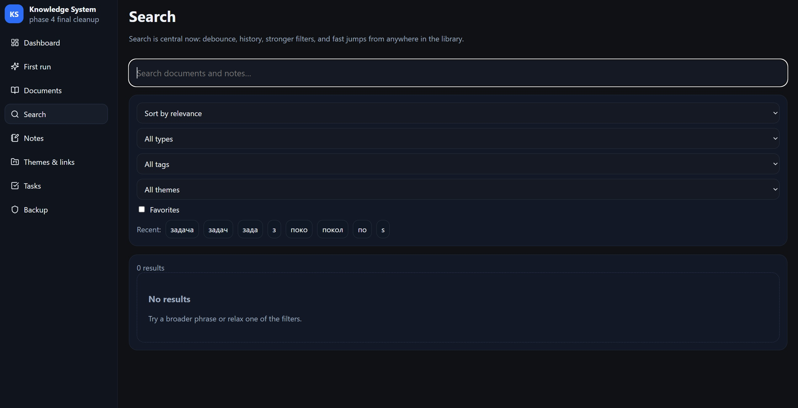
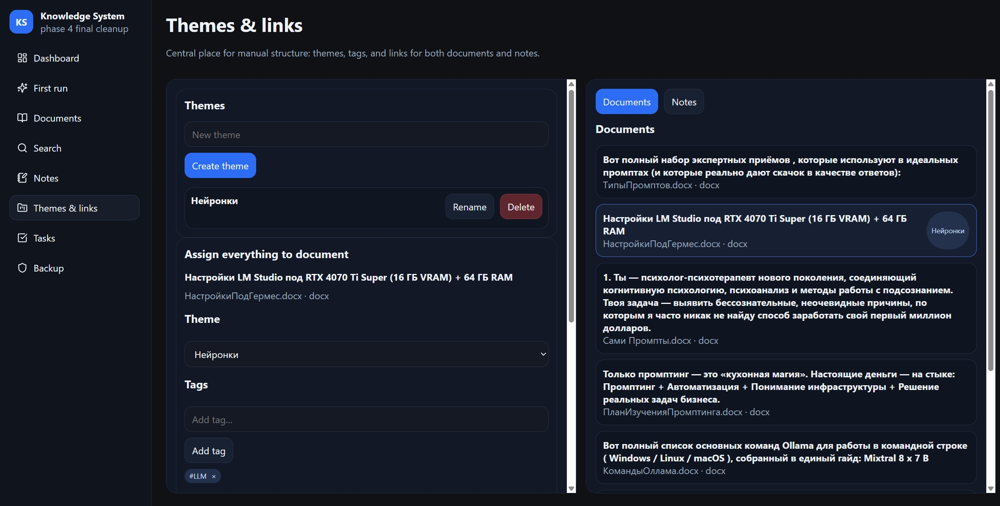
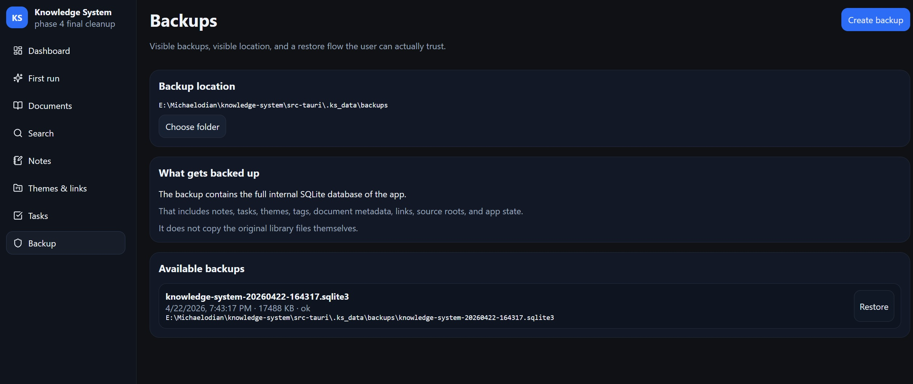

# Local Knowledge Management System

Built a local knowledge management system to unify documents, notes, links, search, and tasks in one structured desktop workspace.

## Overview

The system is designed to reduce file chaos, preserve context, and support real daily work with information instead of leaving documents, notes, and action items scattered across separate tools and folders.

The goal was to replace fragmented file browsing and disconnected note-taking with one local system for reading, writing, organizing, and retrieving information.

## Core Functionality

- local library onboarding and document indexing
- support for `.md`, `.txt`, and `.docx`
- search with direct jump to matching results
- note-taking linked to documents
- themes, tags, and manual linking
- task tracking tied to knowledge workflows
- backup and restore for the internal app state

## Product Structure

The application includes:
- Dashboard
- First run / onboarding
- Documents
- Notes
- Search
- Themes & Links
- Tasks
- Backup / Restore

## Technical Stack

- Tauri
- React
- Rust
- SQLite

## Key Value

The system combines documents, notes, organization, and actions in one local workflow.

Instead of treating files, thoughts, and follow-up tasks as separate things, it turns them into one structured knowledge workspace.

## Proof

See `/docs` for:
- case summary PDF
- onboarding flow
- dashboard
- documents view
- notes view
- search and jump flow
- themes and links
- tasks
- backup and restore

### Screenshots

## Technical Proof

A small public-safe technical layer is included in `/technical`:
- `data-model.md` — core entities and relationships
- `sqlite-schema.sql` — simplified schema overview

This repository is published as a technical case study, so only representative and safe internal artifacts are exposed publicly.

## Status

Working desktop application, used in practice as a structured local knowledge workspace.
